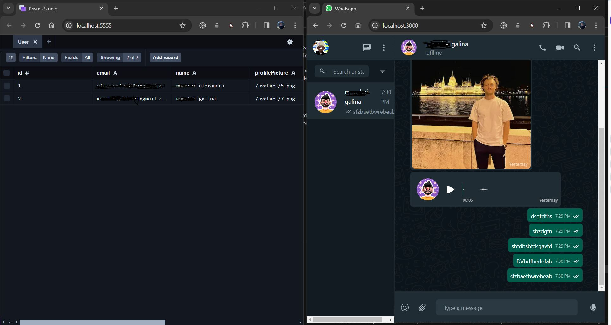

## WhatsApp Clone Project

## Description

What is the WhatsApp Clone App?

This application is a real-time chat and communication platform inspired by the core functionalities of WhatsApp. It enables users to:

Send and receive text messages, audio messages, and images: Interact with others through various message formats in real-time.
Initiate voice and video calls: Communicate seamlessly through audio and video calls, fostering a more personal experience (Note: This feature might require further development for complete functionality).
Manage contacts and online status: View a list of your contacts and identify their current online status.
Key Technologies:

## Backend:

Node.js: JavaScript runtime environment for server-side operations.
Express: Web framework built on top of Node.js for creating web applications.
Socket.IO: Real-time communication library enabling bidirectional event-based exchange.
Prisma: Data access and manipulation tool (Object Relational Mapper - ORM) for interacting with databases.
Multer: Middleware for handling file uploads (specifically used for audio and image messages).
Database (Choose one):
PostgreSQL: Open-source, object-relational database management system (DBMS).
MySQL: Open-source relational DBMS popular for web applications.
SQLite: Self-contained, file-based database suitable for embedded applications.

This project aims to replicate core functionalities of WhatsApp, allowing users to:

Send and receive text messages, audio messages, and images in real-time.
Initiate voice and video calls for seamless communication (Note: This feature might require further refinements).
Manage contacts and view their online status.

## Features:

- Authentication: Users can potentially sign in and create accounts (implementation not provided in the given code).
- Messaging:
  Send and receive text, audio, and image messages in real-time using Socket.IO.
  View message history between users.
- Contacts:
  Manage a list of contacts.
  See online/offline status of contacts (if implemented).
  Real-Time Communication (Socket.IO):
  Enables features like:
  Presence management (showing online users)
  Sending and receiving messages and other updates instantly
  (Potentially) Enabling voice and video calls (requires further work)

## Technologies Used

Backend: Node.js, Express, Socket.IO, Prisma, Multer (file upload handling)
Database: Choose your preferred Prisma-compatible database (e.g., PostgreSQL, MySQL, SQLite)

## Installation

Prerequisites:

Node.js and npm (or yarn): Ensure you have Node.js (version 14 or higher) and npm (or yarn) installed on your system. Download them from https://nodejs.org/en/download/.
Clone the Repository:

Bash
git clone https://github.com/Francys04/whatsapp_clone.git

Navigate to the Project Directory:

Bash
cd whatsapp-clone

Install Dependencies:

Bash
npm install

Create .env File:

Create a file named .env in the project root directory.

Add the following environment variables, replacing placeholders with your actual values:

PORT=5000 # Port for the server (you can change this if needed)
DATABASE_URL=your_prisma_database_url # Replace with your actual database URL

# (Optional) SECRET_KEY=your_secret_key # For token generation and security (consider a strong key)

## Running the Server

Start the Server:

Bash
npm start

Access the Application:

The server will typically start listening on the port specified in the .env file (default: 5000).
Open your web browser and navigate to http://localhost:5000 to access the application (if you have a frontend component).

## API Endpoints

Authentication:

/api/auth/check-user: Verifies user credentials (replace with your actual implementation).
/api/auth/onBoardUser: Onboards new users (replace with your actual implementation).
/api/auth/get-contacts: Fetches user contacts (replace with your actual implementation).
/api/auth/generate-token/:userId: Generates an authentication token (replace with your actual implementation).
Messages:

/api/messages/add-message: Sends a text message.
/api/messages/get-messages/:from/:to: Retrieves messages between two users.
/api/messages/get-initial-contacts/:from: Retrieves initial contacts with message details for a user.
/api/messages/add-audio-message: Sends an audio message (file upload).
/api/messages/add-image-message: Sends an image message (file upload).
Real-Time Communication (Socket.IO):

The server uses Socket.IO to enable real-time communication features, including:
Presence management (indicating online users)
Sending and receiving messages in real-time
Database Setup:

Choose a Database: Select a Prisma-compatible database (e.g., PostgreSQL, MySQL, SQLite).
Set Up Database: Create the database based on your chosen platform's instructions.
Configure Prisma Client:
Update the DATABASE_URL environment variable in your .env file with your actual database connection details.
(Optional) If using a custom database schema, create Prisma models to define your data structure and interactions (refer to Prisma documentation for details).

## Frontend Integration (Optional):

Develop a frontend component (using React, Vue, Angular, or another framework) to interact with the API endpoints.
Implement user interface elements for chat, contacts, sending/receiving messages, and (potentially) voice/video calls.

